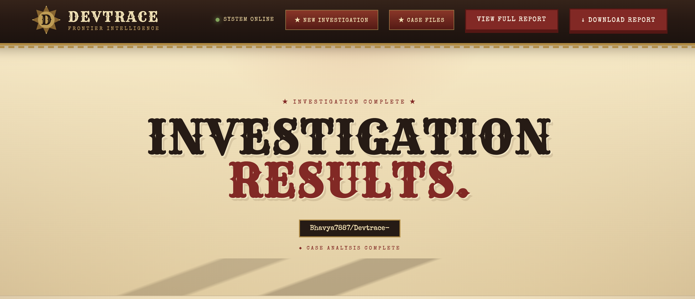
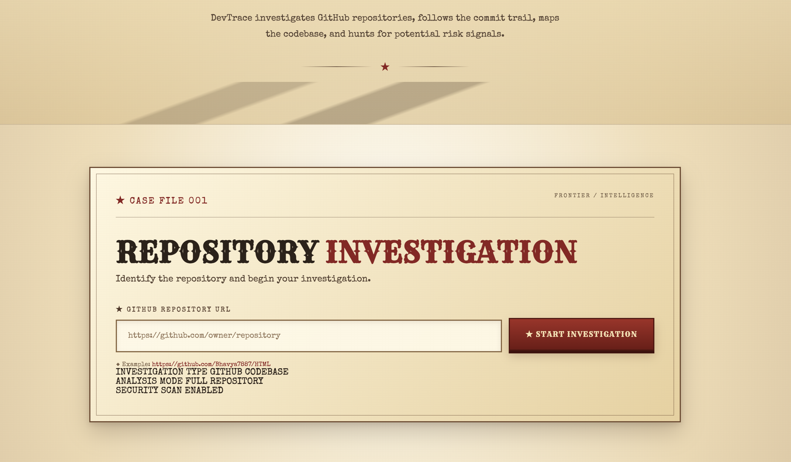
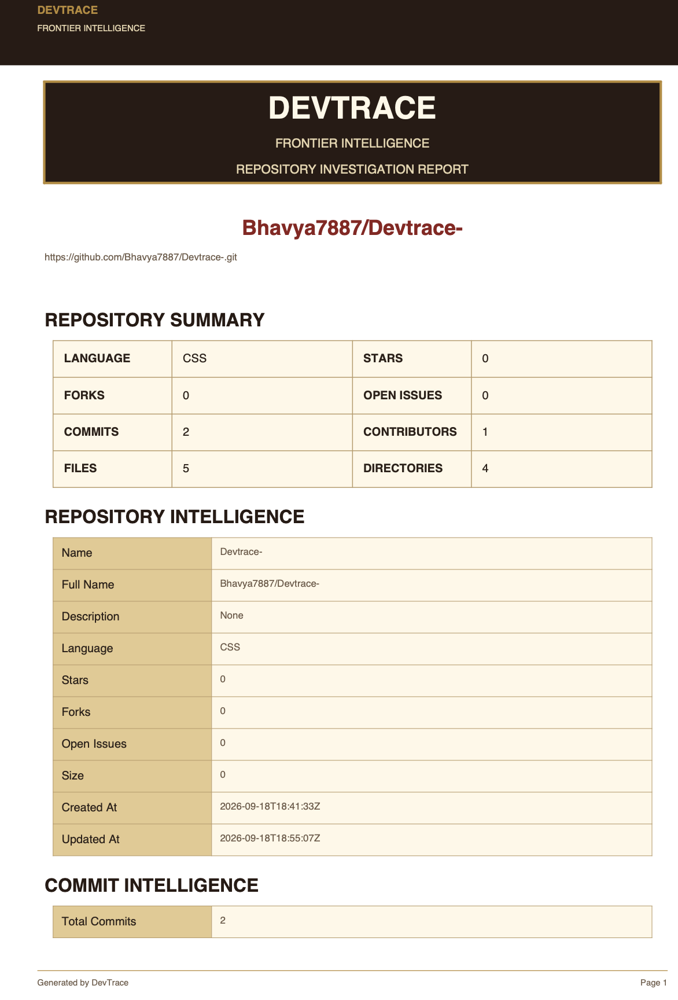
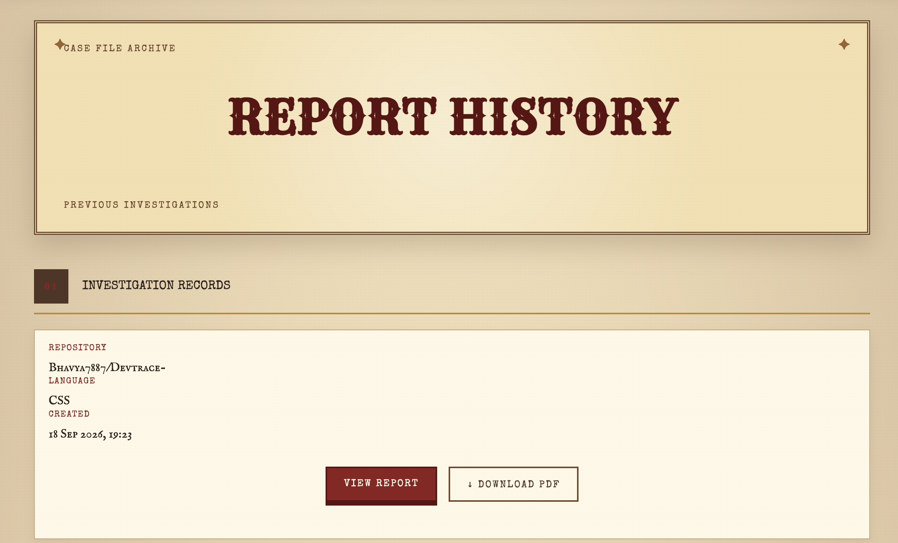
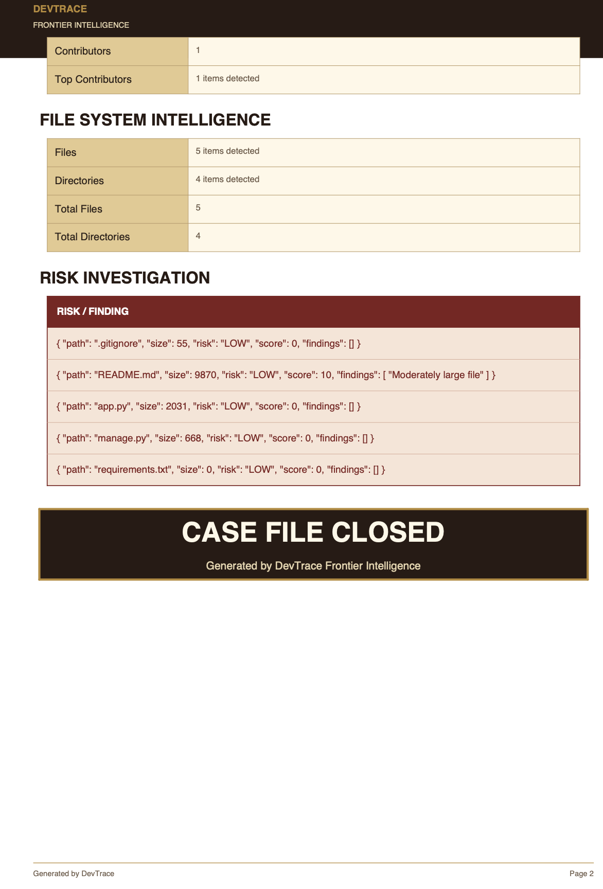

# 🔎 DevTrace — Frontier Intelligence

<p align="center">
  <strong>GitHub Repository Intelligence & Risk Analysis Platform</strong>
</p>

<p align="center">
  Analyze repositories. Understand development activity. Generate structured intelligence reports.
</p>

<p align="center">
  
  
  
  
  
</p>

---

## 🧭 Overview

**DevTrace** is a Django-based developer intelligence platform that analyzes public GitHub repositories and transforms raw repository data into structured investigation reports.

Instead of simply displaying GitHub statistics, DevTrace examines multiple dimensions of a repository — including commits, contributors, files, repository metadata, and development risks — through a unified dashboard.

### Core Pipeline

```text
GitHub Repository
       │
       ▼
   GitHub API
       │
       ▼
 Repository Data
       │
 ┌─────┼─────────────┐
 ▼     ▼             ▼
Commits Files   Contributors
 │      │             │
 └──────┼─────────────┘
        ▼
   Risk Analysis
        │
        ▼
 Investigation Report
        │
        ▼
 Report History
```

---

# ✨ Features

### 🔍 Repository Intelligence

Analyze important repository information including:

* Repository name
* Repository URL
* Primary programming language
* Stars
* Forks
* Open issues
* Repository metadata

### 📈 Commit Analysis

Understand repository development activity:

* Total commits
* Commit history
* Contributor activity
* Top contributors

### 📁 Codebase Analysis

Inspect repository structure:

* Total files
* Total directories
* File information
* Repository structure

### ⚠️ Risk Analysis

DevTrace processes repository information to identify development and repository-level risk indicators.

### 📑 Investigation Reports

Generate structured reports containing the analyzed repository information.

### 🕒 Report History

Previously generated reports can be stored and accessed through the dashboard.

---

# 🖥️ Screenshots

> Add your project screenshots inside the `screenshots/` folder.

### 🏠 Dashboard



### 🔎 Repository Analysis



### 📊 Investigation Results



### 📑 Report History



### 📄 Report Details



---

# 🏗️ Architecture

```text
                         ┌─────────────────────┐
                         │     GitHub API      │
                         └──────────┬──────────┘
                                    │
                                    ▼
                         ┌─────────────────────┐
                         │   GitHub Client     │
                         └──────────┬──────────┘
                                    │
                                    ▼
                    ┌─────────────────────────────┐
                    │      Analysis Engine        │
                    ├─────────────────────────────┤
                    │ Repository Analyzer          │
                    │ Commit Analyzer              │
                    │ File Analyzer                │
                    │ Risk Analyzer                │
                    └──────────────┬──────────────┘
                                   │
                                   ▼
                         ┌─────────────────────┐
                         │  Django Dashboard   │
                         └──────────┬──────────┘
                                    │
                                    ▼
                         ┌─────────────────────┐
                         │ Investigation Report│
                         └──────────┬──────────┘
                                    │
                                    ▼
                         ┌─────────────────────┐
                         │   Report History    │
                         └─────────────────────┘
```

---

# 🛠️ Tech Stack

| Technology     | Purpose                    |
| -------------- | -------------------------- |
| **Python**     | Core application logic     |
| **Django**     | Web framework              |
| **GitHub API** | Repository data collection |
| **SQLite**     | Report persistence         |
| **HTML5**      | Frontend structure         |
| **CSS3**       | UI styling                 |
| **Git/GitHub** | Version control            |

---

# 📂 Project Structure

```text
Devtrace/
│
├── analyzer/
│   ├── __init__.py
│   ├── commits.py
│   ├── files.py
│   ├── repository.py
│   └── risk.py
│
├── dashboard/
│   ├── migrations/
│   ├── static/
│   │   └── dashboard/
│   │       └── style.css
│   ├── templates/
│   │   └── dashboard/
│   │       ├── analyze.html
│   │       ├── history.html
│   │       ├── report_detail.html
│   │       ├── report_history.html
│   │       └── result.html
│   ├── admin.py
│   ├── apps.py
│   ├── models.py
│   ├── urls.py
│   └── views.py
│
├── devtrace_web/
│   ├── settings.py
│   ├── urls.py
│   ├── asgi.py
│   └── wsgi.py
│
├── github/
│   ├── __init__.py
│   └── client.py
│
├── app.py
├── manage.py
├── requirements.txt
├── .gitignore
└── README.md
```

---

# ⚙️ Installation

## 1. Clone the repository

```bash
git clone https://github.com/Bhavya7887/Devtrace-.git
cd Devtrace-
```

## 2. Create a virtual environment

### macOS / Linux

```bash
python3 -m venv venv
source venv/bin/activate
```

### Windows

```bash
python -m venv venv
venv\Scripts\activate
```

## 3. Install dependencies

```bash
pip install -r requirements.txt
```

---

# 🔐 Configuration

DevTrace communicates with GitHub through the GitHub API.

Create a local environment file:

```text
.env
```

Store your GitHub token there rather than committing it to the repository.

Example:

```text
GITHUB_TOKEN=your_github_token
```

Then load it through your application configuration.

### ⚠️ Security

**Never commit API keys, tokens, passwords, or other secrets to GitHub.**

The `.gitignore` file is configured to keep sensitive local configuration out of the repository.

---

# ▶️ Running DevTrace

Apply database migrations:

```bash
python manage.py migrate
```

Start the development server:

```bash
python manage.py runserver
```

Open the application:

```text
http://127.0.0.1:8000/
```

---

# 🔬 Example Workflow

### Step 1 — Enter Repository

Provide a public GitHub repository URL.

```text
https://github.com/Bhavya7887/HTML
```

### Step 2 — DevTrace Collects Data

The GitHub API is queried for repository information.

### Step 3 — Analysis

The analysis engine processes:

```text
Repository
   ↓
Commits
   ↓
Contributors
   ↓
Files
   ↓
Risk Indicators
```

### Step 4 — Report Generation

The dashboard presents the results as a structured investigation report.

### Step 5 — Save & Review

Generated reports can be stored and reviewed through report history.

---

# 🎯 Why DevTrace?

Most beginner developer projects focus on simple CRUD operations.

DevTrace was designed to explore a more realistic developer-tool workflow involving:

* External API integration
* Backend data processing
* Repository analysis
* Software engineering concepts
* Risk analysis
* Database persistence
* Web dashboard development

The project combines these components into a single end-to-end application.

---

# 🚀 Future Roadmap

Planned improvements include:

* [ ] AI-powered repository summaries
* [ ] Advanced code-quality analysis
* [ ] Repository comparison
* [ ] Interactive analytics
* [ ] PDF report export
* [ ] GitHub OAuth authentication
* [ ] AI-generated developer recommendations
* [ ] Historical repository trend analysis
* [ ] Deployment with a production database

---

# 📌 Project Status

**Current status:** Active development

The core repository analysis, Django dashboard, investigation reports, and report-history workflow are implemented.

---

# 👨‍💻 Author

### Bhavya Sandhu

Computer Science Engineering Student

**GitHub:**
https://github.com/Bhavya7887

**LinkedIn:**
https://linkedin.com/in/bhavya-sandhu-049673324

---

# ⭐ Support

If you find DevTrace interesting, consider giving the repository a ⭐.

---

<p align="center">
  Built with Python, Django & GitHub API
</p>
